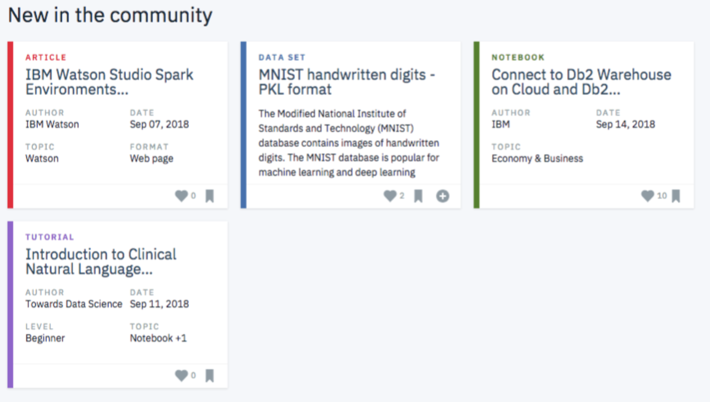
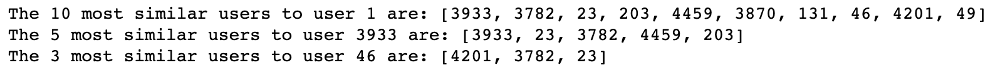
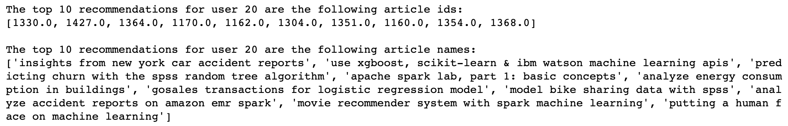

# Recommendations Using Collaborative Filtering and Matrix Factorization

For this project, we'll analyze the interactions that users have with articles on the IBM Watson Studio platform, and make recommendations to them about new articles we think they will like.

## Packages

This project primarily uses pandas and numpy.

## Motivation

Recommend content to users based on their interests and similar users.

## Credit

This was part of Udacity's Data Scientist Nanodegree.

## Files

The main files is **Recommendations_with_IBM.ipynb**, which is a notebook walking through the collaborative filtering
and matrix factorization process.

## Results

One of our functions allows us to see which users are most similar to a given user. This is computed by taking
the dot product of user-article interactions.

Sample recommendations from the collaborative filtering portion of the notebook. To generate these recommendations,
we find the most similar users to a given user based on their similarity (dot product) and number of article interactions.
Then, we choose articles that the given user hasn't already seen and that have the most total interactions.
